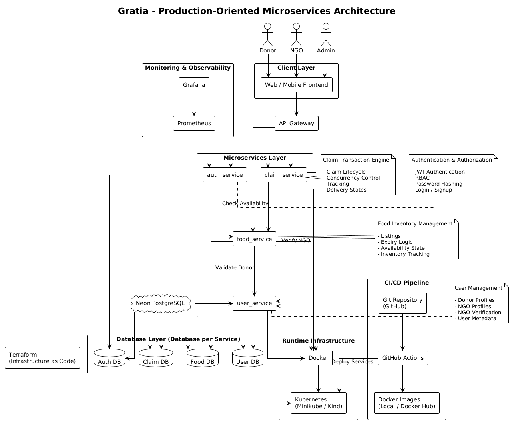
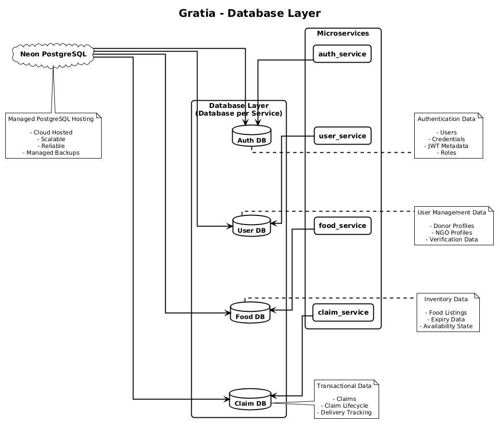
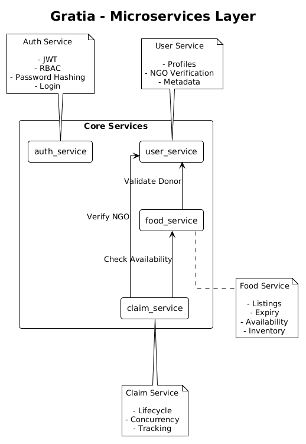
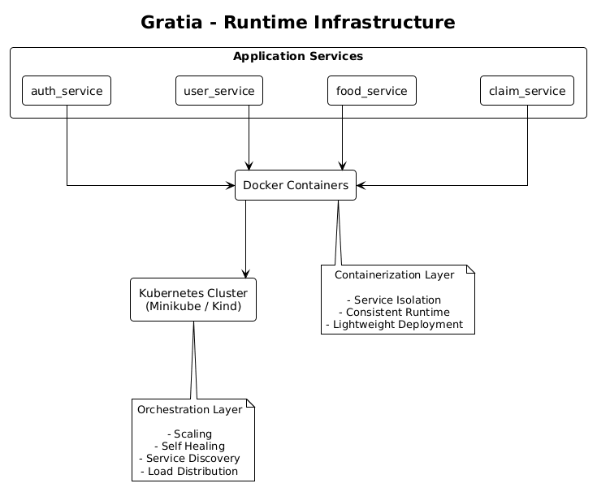
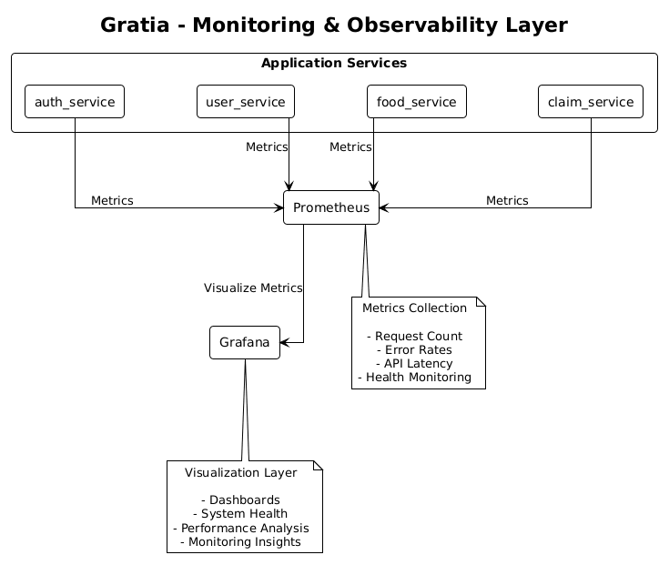
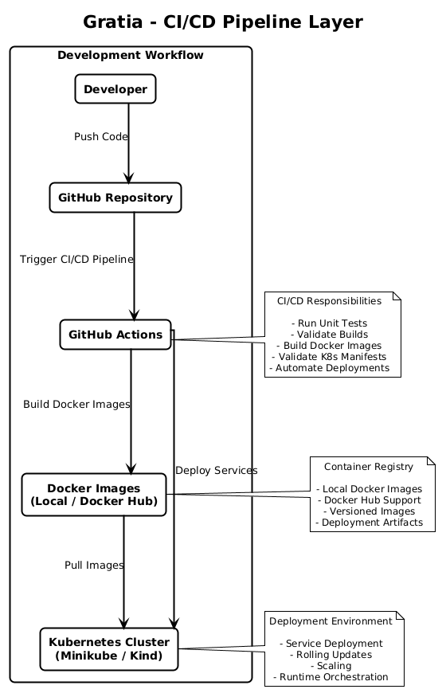

# Gratia

## Distributed Microservices Platform for Food Redistribution and Waste Reduction

Gratia is a production-oriented distributed microservices platform designed to reduce food wastage by enabling efficient redistribution of excess food from donors to NGOs and organizations involved in food distribution.

The system is designed around the idea that large quantities of edible food are wasted every day by restaurants, events, caterers, grocery stores, and individuals, while many communities and organizations continue to face food scarcity.

Gratia attempts to solve this problem by building a secure, scalable, and traceable platform where:

* Donors can create food donation listings
* Verified NGOs can discover and claim food
* Claims are tracked through their entire lifecycle
* Administrators can monitor and regulate the ecosystem
* The system ensures consistency, trust, and transactional integrity

The project is intentionally designed as a distributed microservices architecture rather than a monolithic CRUD application in order to demonstrate real-world backend engineering concepts such as:

* Microservices communication
* Distributed system design
* Service isolation
* Database-per-service architecture
* Containerization and orchestration
* Infrastructure as Code
* Monitoring and observability
* CI/CD workflows
* Production-oriented deployment strategies

---

# Table of Contents

1. Project Vision
2. Core Objectives
3. System Architecture
4. Architecture Principles
5. Microservices Overview
6. Technology Stack
7. Service Responsibilities
8. Complete System Workflow
9. Security Architecture
10. Database Strategy
11. Inter-Service Communication
12. Containerization and Deployment
13. Kubernetes and Orchestration
14. Monitoring and Observability
15. Infrastructure as Code
16. CI/CD Pipeline
17. Project Structure
18. API Design Philosophy
19. Claim Lifecycle
20. Concurrency Handling
21. Scalability Considerations
22. Future Improvements
23. Local Development Setup
24. Deployment Strategy
25. Engineering Challenges
26. Learning Outcomes
27. License

---

# 1. Project Vision

The primary vision behind Gratia is to build a reliable and scalable platform capable of coordinating food redistribution in a transparent and trustworthy manner.

The project is not merely focused on creating APIs or storing food listings. Instead, it is designed to model a real-world distributed system where multiple independent services collaborate to execute critical business workflows.

The platform aims to address several practical challenges:

* Food wastage due to lack of redistribution channels
* Lack of trust between donors and receivers
* Absence of visibility into donation tracking
* Risk of duplicate claims
* Poor coordination between supply and demand

The system introduces verification workflows, lifecycle tracking, and transactional safeguards to ensure that food movement remains traceable and reliable.

---

# 2. Core Objectives

The project is designed around the following technical and functional objectives.

## Functional Objectives

* Enable donors to create food donation listings
* Enable NGOs to discover and claim food
* Track donation lifecycle from creation to delivery
* Prevent duplicate food claims
* Maintain verification workflows for NGOs
* Provide role-based access control

## Technical Objectives

* Build a production-oriented microservices architecture
* Implement Clean / Hexagonal Architecture principles
* Maintain service independence
* Ensure database isolation per service
* Demonstrate container orchestration using Kubernetes
* Implement CI/CD workflows
* Integrate monitoring and observability tools
* Demonstrate Infrastructure as Code concepts

---

# 3. System Architecture



[View PlantUML Source](docs/puml_diagrams/high-level_architecture.puml)

The system follows a layered distributed architecture consisting of:

* Client Layer
* API Gateway Layer
* Microservices Layer
* Database Layer
* Infrastructure Layer
* DevOps Layer

At a high level:

1. Users interact with the frontend
2. Requests are routed to backend services
3. Services communicate through REST APIs
4. Each service owns its own database
5. Containers are orchestrated using Kubernetes
6. Monitoring tools observe system health
7. CI/CD pipelines automate deployments

The architecture emphasizes separation of concerns, service independence, and production-oriented design.

---

# 4. Architecture Principles

## 4.1 Clean Architecture

Each service follows a Clean / Hexagonal Architecture inspired structure where:

* Business logic remains independent of frameworks
* Infrastructure concerns are isolated
* Repository and transport layers are abstracted
* Services remain testable and modular

Typical structure:

```text
/cmd
/internal
    /handler
    /service
    /repository
    /model
    /middleware
    /client
/migrations
/docs
```

---

## 4.2 Database per Service


## Database Architecture



[View PlantUML Source](docs/puml_diagrams/database_layer.puml)


Every microservice owns its own database.

This ensures:

* Loose coupling
* Independent scaling
* Clear ownership boundaries
* Better maintainability

No service directly accesses another service’s database.

All communication happens through APIs.

---

## 4.3 Stateless Authentication

Authentication is implemented using JWT-based stateless authentication.

This allows:

* Scalability
* Simpler horizontal scaling
* Reduced session management complexity

---

## 4.4 Containerized Deployment

Every service is containerized independently using Docker.

This ensures:

* Environment consistency
* Simplified deployment
* Service isolation
* Portability across environments

---

# 5. Microservices Overview



[View PlantUML Source](docs/puml_diagrams/microservice_layer.puml)
The system consists of four primary backend services.

## auth_service

Responsible for:

* Authentication
* JWT token generation
* Password hashing
* Role-Based Access Control
* User login and signup

---

## user_service

Responsible for:

* Donor profile management
* NGO profile management
* NGO verification workflows
* User metadata management

---

## food_service

Responsible for:

* Food listing management
* Inventory tracking
* Expiry handling
* Availability management

---

## claim_service

Responsible for:

* Claim creation
* Claim lifecycle management
* Concurrency control
* Donation tracking
* Transaction coordination

---

# 6. Technology Stack

## Backend

* Go (Golang)
* Gin / Chi (planned)
* REST APIs

## Database

* PostgreSQL
* Neon PostgreSQL (Cloud Managed PostgreSQL)

## Containerization

* Docker
* Docker Compose

## Orchestration

* Kubernetes
* Minikube / Kind

## Monitoring

* Prometheus
* Grafana

## Infrastructure

* Terraform

## CI/CD

* GitHub Actions

## Documentation

* OpenAPI / Swagger

---

# 7. Service Responsibilities

## auth_service

The authentication service acts as the central security authority of the platform.

It handles:

* User signup
* Login authentication
* Password hashing using bcrypt
* JWT generation and validation
* Role enforcement

The service implements Role-Based Access Control (RBAC) using roles such as:

* DONOR
* NGO
* ADMIN

JWT middleware is shared across services to ensure consistent authentication handling.

---

## user_service

The user service acts as the system of record for user-related information.

It maintains:

* Donor profiles
* NGO profiles
* Verification status
* Organizational metadata

A dedicated NGO verification workflow ensures that only approved organizations can participate in claim operations.

---

## food_service

The food service functions as the inventory management system.

Each food listing includes:

* Food type
* Quantity
* Expiry time
* Pickup location
* Listing status
* Donor reference

The service ensures that:

* Expired food cannot be claimed
* Claimed food becomes unavailable
* Invalid donors cannot create listings

---

## claim_service

The claim service is the transactional core of the system.

It coordinates:

* NGO validation
* Food availability validation
* Claim creation
* Lifecycle transitions
* Delivery tracking

The service also implements concurrency protection mechanisms to prevent multiple NGOs from claiming the same food item simultaneously.

---

# 8. Complete System Workflow

A typical end-to-end workflow in Gratia proceeds as follows:

1. A donor signs up and logs into the platform
2. The donor creates a food donation listing
3. The food service validates donor identity
4. The listing becomes publicly available
5. A verified NGO discovers the listing
6. The NGO submits a claim request
7. The claim service validates:

   * NGO verification status
   * Food availability
8. A claim record is created
9. The donor accepts or rejects the claim
10. The claim progresses through lifecycle states
11. Delivery status is updated until completion

This workflow demonstrates coordination across multiple distributed services.

---

# 9. Security Architecture

Security is implemented through multiple layers.

## Authentication

* JWT-based stateless authentication
* Secure password hashing using bcrypt

## Authorization

* Role-Based Access Control
* Route-level authorization checks

## Secure Communication

* Planned HTTPS support
* Secure environment variable management

## Validation

* Request validation
* Input sanitization
* Middleware-based authorization

---

# 10. Database Strategy

The system follows a strict database-per-service approach.

Each service owns its schema and migration history.

## Example Databases

### auth_service

* users
* refresh_tokens

### user_service

* donor_profiles
* ngo_profiles
* ngo_verifications

### food_service

* food_listings

### claim_service

* claims
* claim_events

Database migrations are maintained using version-controlled SQL migration files.

---

# 11. Inter-Service Communication

Services communicate using internal REST APIs.

Examples:

* food_service validates donors through user_service
* claim_service validates NGOs through user_service
* claim_service checks food availability through food_service

This design ensures:

* Service independence
* Clear ownership boundaries
* Better maintainability

---

# 12. Containerization and Deployment

## Runtime Infrastructure



[View PlantUML Source](docs/puml_diagrams/runtime_infrastructure.puml)

Each microservice is containerized independently using Docker.

Docker is used to:

* Standardize runtime environments
* Simplify deployments
* Improve portability
* Isolate services

Multi-stage Docker builds are planned to:

* Reduce image size
* Improve security
* Optimize runtime performance

Docker Compose is used during development to simulate distributed deployments locally.

---

# 13. Kubernetes and Orchestration

Kubernetes is used to understand and demonstrate orchestration concepts.

The project uses:

* Minikube
  OR
* Kind

instead of managed Kubernetes services such as AWS EKS in order to maintain cost efficiency while still learning production-oriented orchestration workflows.

Kubernetes concepts demonstrated include:

* Pods
* Deployments
* Services
* Ingress
* ConfigMaps
* Secrets
* Autoscaling

---

# 14. Monitoring and Observability



[View PlantUML Source](docs/puml_diagrams/monitoring_layer.puml)

The platform integrates observability tools to monitor runtime behavior.

## Prometheus

Used for:

* Metrics collection
* Request tracking
* Latency monitoring
* Error monitoring

## Grafana

Used for:

* Dashboard visualization
* System health monitoring
* Performance analysis

Each service exposes health endpoints for monitoring and orchestration readiness checks.

---

# 15. Infrastructure as Code

Terraform is used to demonstrate Infrastructure as Code principles.

The project uses Terraform for:

* Infrastructure experimentation
* Declarative resource provisioning
* Reproducible environments
* Version-controlled infrastructure management

---

# 16. CI/CD Pipeline



[View PlantUML Source](docs/puml_diagrams/pipeline_layer.puml)

CI/CD workflows are implemented using GitHub Actions.

The pipeline automates:

1. Code validation
2. Automated testing
3. Docker image builds
4. Kubernetes deployment workflows

This ensures:

* Faster deployments
* Consistent releases
* Reduced manual intervention

---

# 17. Project Structure

```text
/gratia
    /auth_service
    /user_service
    /food_service
    /claim_service
    /shared
    /infrastructure
    /k8s
    /terraform
    /docs
```

---

# 18. API Design Philosophy

The APIs are designed around:

* RESTful principles
* Predictable response structures
* Consistent error handling
* Stateless communication
* Clear resource ownership

Swagger/OpenAPI documentation is planned for all services.

---

# 19. Claim Lifecycle

The claim lifecycle is one of the most important parts of the system.

## Claim States

* CREATED
* ACCEPTED
* REJECTED
* PICKED_UP
* DELIVERED
* CANCELLED

The lifecycle ensures that food movement remains traceable and auditable.

---

# 20. Concurrency Handling

The claim service implements concurrency protection to prevent duplicate claims.

Potential approaches include:

* Database-level locking
* Atomic update queries
* Transaction isolation strategies

This is critical because multiple NGOs may attempt to claim the same food item simultaneously.

---

# 21. Scalability Considerations

The architecture is intentionally designed for horizontal scalability.

Each service can scale independently depending on load.

Examples:

* claim_service can scale independently during high claim traffic
* food_service can scale based on listing volume

Container orchestration and stateless authentication simplify horizontal scaling.

---

# 22. Future Improvements

Planned future enhancements include:

* Event-driven architecture
* Kafka / message queues
* Notification service
* Real-time tracking
* API Gateway integration
* Distributed tracing
* Rate limiting
* Circuit breakers
* Retry mechanisms
* Object storage for media uploads

---

# 23. Local Development Setup

## Prerequisites

* Go
* Docker
* Docker Compose
* PostgreSQL
* Minikube / Kind
* kubectl

## Clone Repository

```bash
git clone <repository-url>
cd gratia
```

## Run Services Locally

```bash
docker-compose up --build
```

## Run Kubernetes Setup

```bash
minikube start
kubectl apply -f k8s/
```

---

# 24. Deployment Strategy

The deployment strategy focuses on cost-efficient production-style deployment.

The project intentionally avoids expensive managed infrastructure services during development.

Deployment stack:

* Local Kubernetes cluster
* Docker images
* Neon PostgreSQL
* GitHub Actions CI/CD

This provides production-oriented learning while remaining financially practical.

---

# 25. Engineering Challenges

This project involves several real-world engineering challenges:

* Managing distributed transactions
* Designing clear service boundaries
* Preventing race conditions
* Maintaining consistency across services
* Handling inter-service communication
* Implementing observability
* Managing deployment complexity

The goal of the project is not merely feature completion but understanding how production-grade distributed systems are engineered.

---

# 26. Learning Outcomes

This project demonstrates practical understanding of:

* Microservices architecture
* Distributed systems
* Backend engineering
* REST API design
* Containerization
* Kubernetes orchestration
* Infrastructure as Code
* Monitoring and observability
* CI/CD workflows
* Scalable system design

---

# 27. License

This project is licensed under the MIT License.

---

# Author

Aditya Abhay Waradkar

Computer Engineering Student
SIES Graduate School of Technology

---

# Final Note

Gratia is a practical exploration of modern backend engineering, distributed systems, and production-oriented architecture.

The project focuses heavily on architectural correctness, scalability, service isolation, operational reliability, and real-world engineering practices.

The long-term objective is to continuously evolve the platform while deepening understanding of cloud-native backend systems and distributed application design.
